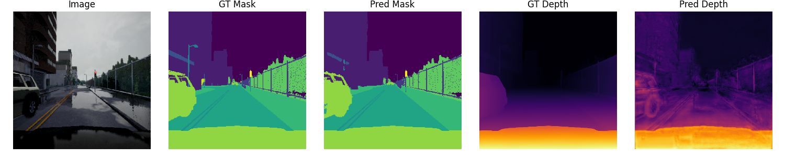
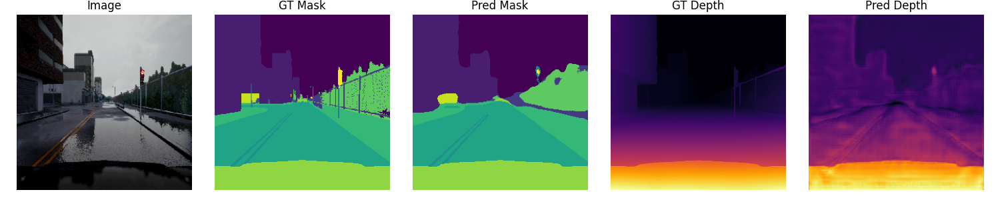
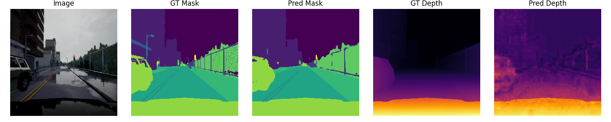

# Multi-Task Learning: Segmentation and Depth Estimation

This project explores Multi-Task Learning (MTL) by modifying a U-Net architecture to simultaneously perform semantic segmentation and depth estimation from a single input image. I have  evaluated the impact of architectural variations, specifically the role of skip connections and residual learning, on model performance.

## Setup and Installation

This project uses `uv` , to make life easy install it once :)

### 1. Install uv

If you don't have `uv` installed, run:

```bash
curl -LsSf https://astral.sh/uv/install.sh | sh
```

### 2. Install Dependencies

Once `uv` is set up, navigate to the project root and synchronize the environment:

```bash
uv sync
```

### 1. Architectures

I have implemented and compared three distinct versions of the Multi-Task U-Net:

- **Vanilla Multi-Task U-Net**: A standard U-Net modified with two output heads for simultaneous segmentation and depth prediction.

- **U-Net without Skip Connections**: Removed all spatial feature copying between the encoder and decoder to test the importance of local spatial information.

- **U-Net with Residual Blocks**: Replaced standard convolutional blocks with Residual Blocks (two 3×3 convolutions, BatchNorm, and ReLU with a shortcut connection) to improve gradient flow.

### 2. Loss Function & Metrics

To train both tasks, we used a weighted combined loss function:

```
L_total = L_seg + 0.2 · L_depth
```

- **Segmentation**: Evaluated using Cross-Entropy Loss and Mean Intersection over Union (mIoU).

- **Depth Estimation**: Evaluated using Mean Squared Error (MSE) during training and Root Mean Square Error (RMSE) for final reporting.

## Results and Insights

### Quantitative Comparison

| Model Variant | mIoU (Seg) | RMSE (Depth) | Final Test Loss |
|---|---|---|---|
| Vanilla U-Net | 0.7655 | 0.0507 | 0.0684 |
| Without Skip Connections | 0.5862 | 0.0512 | 0.1821 |
| With Residual Blocks | 0.7933 | 0.0560 | 0.0506 |

### Visual Results

#### Vanilla Multi-Task U-Net


#### U-Net without Skip Connections


#### U-Net with Residual Blocks


### Key Insights

- **The Power of Skip Connections**: Removing skip connections led to a massive drop in mIoU (~0.18). Boundaries became noticeably blurrier because the decoder could no longer access fine-grained spatial details from the encoder.

- **Residual Learning Benefits**: The Residual U-Net achieved the highest segmentation accuracy (0.793 mIoU). The shortcut connections facilitate deeper feature extraction and sharper boundary delineation.

- **Task Imbalance**: While Residual Blocks significantly improved segmentation, the depth RMSE slightly increased. This suggests that depth estimation may require more specific hyperparameter tuning or a different weighting factor to benefit as much as the classification task does.

## 🔗 Experiment Tracking (WandB)

Detailed logs, including training/validation loss curves and metric trends, can be found in the following experiment runs:

- Vanilla Multi-Task U-Net: https://api.wandb.ai/links/adityapeketii-iiit-hyderabad/qtxe4x2p
- U-Net without Skip Connections: https://api.wandb.ai/links/adityapeketii-iiit-hyderabad/au3a1h7m
- U-Net with Residual Blocks: https://api.wandb.ai/links/adityapeketii-iiit-hyderabad/67bhjdun

## Folder Structure

Outputs and visualizations are organized as follows:

```
.
├── vanilla_unet/      # Plots and 10 qualitative examples for Vanilla model
├── without_skip/      # Visual results showing the impact of missing skip connections
├── residual/          # Qualitative results for the residual architecture
└── comparisons/       # Cross-model metric plots and visual comparisons
```
